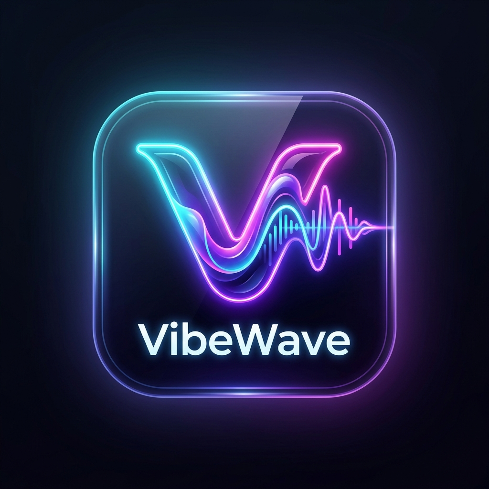
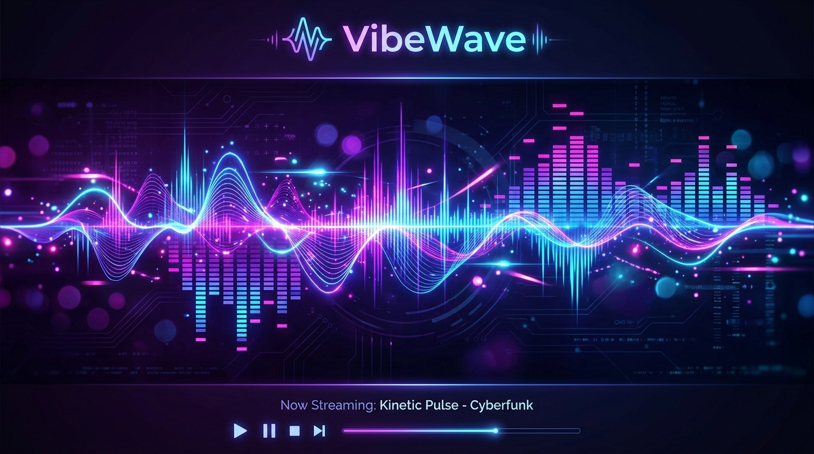

 
 

# VibeWave

### Intelligent, Aesthetic Music Streaming Client
#### Built with ❤️ by [Raj Mishra](https://github.com/MishrajiiCode)

 

 

[**Download**](#download) · [**Features**](#features) · [**AI Engine**](#ai-engine) · [**Developer**](#developer) · [**Disclaimer**](#disclaimer)

> [!NOTE]
> VibeWave is an independent client authored and maintained by **Raj Mishra** ([@MishrajiiCode](https://github.com/MishrajiiCode)).

---

<h1>Features</h1>

<table>
  <tr>
    <td width="50%" valign="top">

#### 🎵 Playback & Audio
- **Search, browse and play** anything available on YouTube Music & JioSaavn.
- **Hi-Res Lossless Audio** — FLAC/ALAC stream resolution with automated fallback.
- **Gapless playback with true crossfade**, adjustable 0–12s.
- **Automix Transition Engine** — Beat-matching and tempo-stretching.
- **Offline Downloads** — Save tracks with embedded high-res cover art.
- **Local Music Library** integration.

</td>
    <td width="50%" valign="top">

#### 🧠 Zero-API AI & Cloud Telemetry
- **On-Device AI Song Picker** — Context-aware music matchmaker without any API keys.
- **Firebase Firestore Telemetry** — Session activity logging and location history (latest & previous).
- **Admin Console** — Live monitoring dashboard for user activities and location audits.
- **In-App Auto Updates** — Direct APK update detection and one-tap installation from GitHub Releases.
- **Live Lyrics & Dynamic Blur** — Real-time synced lyrics with glassmorphic visuals.

</td>
  </tr>
</table>

---

<h1>Zero-API AI Song Picker</h1>

VibeWave features a built-in on-device AI recommendation engine that analyzes your listening context, time of day, desired mood, and energy level to match and queue the ideal songs completely offline without any third-party paid API keys.

---

<h1>Download</h1>

Grab the latest signed APK from the [Releases](https://github.com/MishrajiiCode/VibeWave/releases) page.

---

<h1>About the Developer</h1>

**Raj Mishra** — Lead Architect & Creator  
GitHub: [https://github.com/MishrajiiCode](https://github.com/MishrajiiCode)  
Email: [mishrajiicode@gmail.com](mailto:mishrajiicode@gmail.com)

---

<h1>Disclaimer & Legal Notice</h1>

VibeWave is an independent third-party audio player and client. It is **not** associated with Google LLC, YouTube Music, or any other parent companies.

* **No Media Hosting:** VibeWave does not host or store copyrighted music files.
* **Open Source:** Licensed under the GNU General Public License v3.0 (GPLv3).

